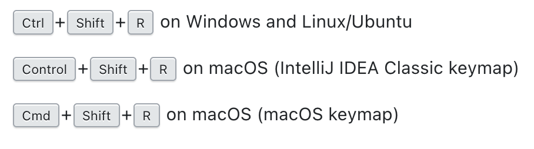

# Messaging

## Configuration
Before using messaging feature in the sample app you need to follow the below steps to configure it:

1. Configure Firebase project for the aep sample app using the firebase [documentation](https://firebase.google.com/docs/cloud-messaging/android/client)
    1. Use `com.adobe.marketing.mobile.sampleapp` as the package name while creating the firebase android app. 
    1. Follow the Firebase [documentation](https://firebase.google.com/docs/cloud-messaging/android/client#add_a_firebase_configuration_file) to download and overwrite the `google-services.json` configuration file in the `Sample-App/app` folder.
1. Setup [Journey Optimizer](https://aep-sdks.gitbook.io/docs/beta/adobe-journey-optimizer)
1. Update the `LAUNCH_ENVIRONMENT_FILE_ID` constant value in `Sample-App/app/src/java/com/adobe/marketing/mobile/sampleapp/MainApp.Java` file with the config app id of the property. 
For more information on how to get the config app id from launch check this [document](https://experienceleague.adobe.com/docs/launch/using/publish/environments/environments.html?lang=en#mobile-configuration) 


# Advertising identifier

## Configuration
To enable advertising identifier features in the sample app, follow these steps:
1. Set your `ENVIRONMENT_FILE_ID` in MainApp.java.
2. Update the value for key `gms_ads_app_id` located in the `secrets.xml` at [aepsdk-sample-app-android/Sample-App/app/src/main/res/values](../Sample-App/app/src/main/res/values/secrets.xml) with a valid Google AdMob app ID.
    - See Google's [quick start reference](https://developers.google.com/admob/android/quick-start) on how to get your AdMob app ID. See step 3 of the [Configure your app](https://developers.google.com/admob/android/quick-start#import_the_mobile_ads_sdk) section for a free public test app ID from Google.
    - Any real key values in the `secrets.xml` file should **not** be committed to the repository.
3. Uncomment the implemention code using [find and replace](https://www.jetbrains.com/help/idea/finding-and-replacing-text-in-project.html#replace_search_string_in_project) to replace all instances of:
```java
/* Ad ID implementation
```
with:
```java
//* Ad ID implementation
```
Find and replace default shortcuts in Android Studio:  
[](./assets/find-and-replace-shortcuts.png)

4. Sync Project with Gradle files using: File -> Sync Project with Gradle Files

The app should now be properly configured to use advertising identifier features.

To **disable** these features, follow these steps:
1. [Find and replace](https://www.jetbrains.com/help/idea/finding-and-replacing-text-in-project.html#replace_search_string_in_project) all instances of:
```java
//* Ad ID implementation
```
with:
```java
/* Ad ID implementation
```
2. Sync Project with Gradle files using: File -> Sync Project with Gradle Files