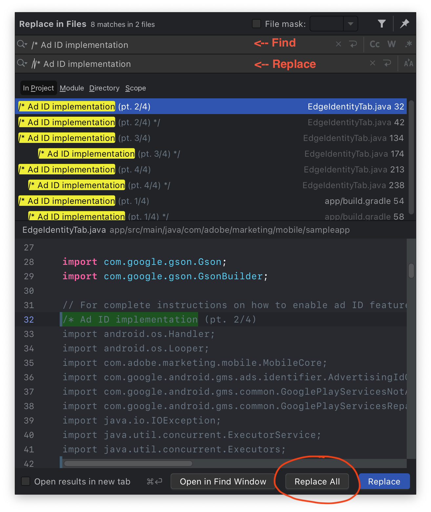
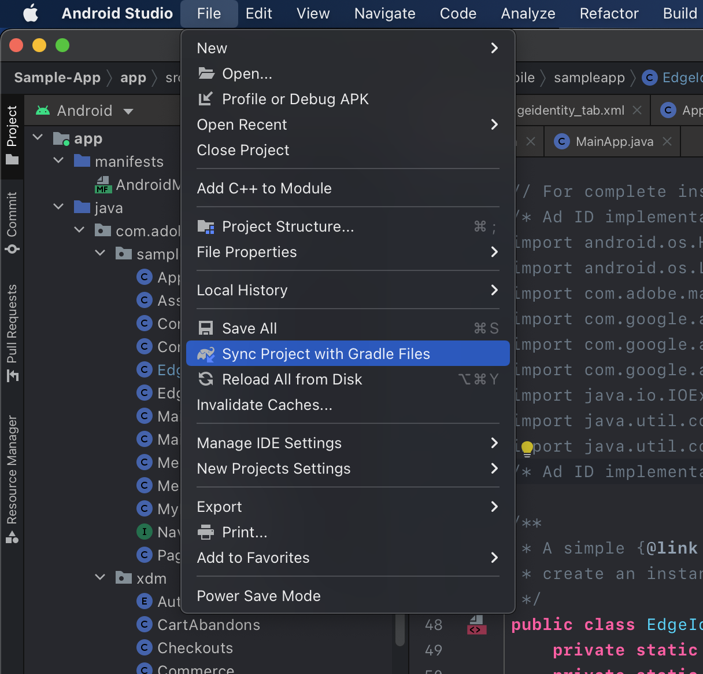

# Messaging

## Configuration
Before using messaging feature in the sample app you need to follow the below steps to configure it:

1. Configure Firebase project for the aep sample app using the firebase [documentation](https://firebase.google.com/docs/cloud-messaging/android/client)
    1. Use `com.adobe.marketing.mobile.sampleapp` as the package name while creating the firebase android app. 
    1. Follow the Firebase [documentation](https://firebase.google.com/docs/cloud-messaging/android/client#add_a_firebase_configuration_file) to download and overwrite the `google-services.json` configuration file in the `Sample-App/app` folder.
1. Setup [Journey Optimizer](https://developer.adobe.com/client-sdks/documentation/adobe-journey-optimizer)
1. Update the `ENVIRONMENT_FILE_ID` constant value in `Sample-App/app/src/java/com/adobe/marketing/mobile/sampleapp/MainApp.Java` file with the config app id of the property. 
For more information on how to get the config app id from Data Collection check this [document](https://experienceleague.adobe.com/docs/launch/using/publish/environments/environments.html?lang=en#mobile-configuration) 


# Advertising identifier

## Configuration
To enable advertising identifier features in the sample app, follow these steps:
1. Update the value for key `gms_ads_app_id` located in the `secrets.xml` at [aepsdk-sample-app-android/Sample-App/app/src/main/res/values](../Sample-App/app/src/main/res/values/secrets.xml) with a valid Google AdMob app ID.
    - See Google's [quick start reference](https://developers.google.com/admob/android/quick-start) on how to get your AdMob app ID. See step 3 of the [Configure your app](https://developers.google.com/admob/android/quick-start#import_the_mobile_ads_sdk) section for a free public test app ID from Google.
    - Any real key values in the `secrets.xml` file should **not** be committed to the repository.
2. By default, the ad ID features are commented out in the sample app. To enable these features, uncomment the implemention code using [find and replace all](https://www.jetbrains.com/help/idea/finding-and-replacing-text-in-project.html#replace_search_string_in_project) to replace all instances of:
```java
/* Ad ID implementation
```
with:
```java
//* Ad ID implementation
```
Each code block has a pair of block comments wrapped around it to enable this behavior:
```java
/* Ad ID implementation (pt. 1/4)
<commented implementation code...>
/* Ad ID implementation (pt. 1/4) */
```

After replacement it will become:
```java
//* Ad ID implementation (pt. 1/4)
<active implementation code!>
//* Ad ID implementation (pt. 1/4) */
```

For convenience, these are the default find and replace shortcuts in Android Studio:  
[](./assets/find-and-replace-shortcuts.png)  

The shortcut should open a window that looks like the following:
[](./assets/find-and-replace-all-example.png)  
There should be 4 pairs of special comment blocks (8 total matches) across two files:
`EdgeIdentityTab.java` and `app/build.gradle`

3. With the implementation code and gradle files uncommented with new dependencies, sync the project with the Gradle file changes using: File -> Sync Project with Gradle Files

[](./assets/sync-project-gradle-example.png)  

The app should now be properly configured to use advertising identifier features.

To **disable** these features, follow these steps:
1. [Find and replace](https://www.jetbrains.com/help/idea/finding-and-replacing-text-in-project.html#replace_search_string_in_project) all instances of:
```java
//* Ad ID implementation
```
with:
```java
/* Ad ID implementation
```
2. Sync Project with Gradle files using: File -> Sync Project with Gradle Files